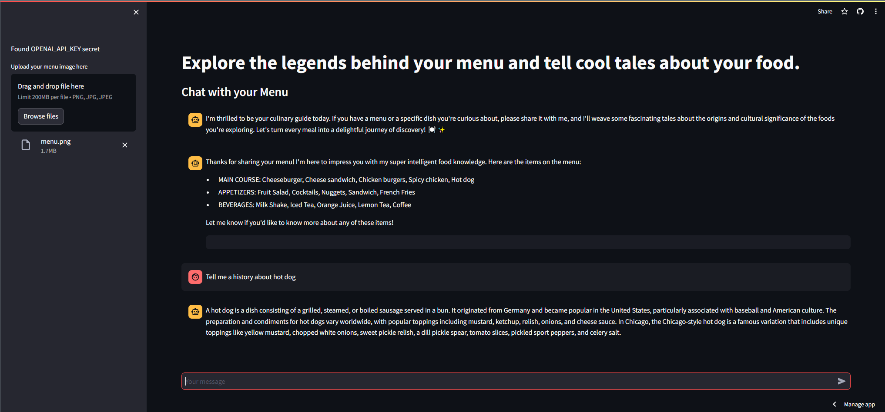

# Foody: Dive into Culinary Stories 🍲📚

## Overview
Welcome to Foody, your digital culinary guide! Foody is a unique application that combines advanced OCR technology with a sophisticated chatbot to bring the history and stories behind your favorite dishes right to your fingertips. With Foody, every meal is not just food but a journey through history and culture.

## Features
- **Image Upload**: Easily upload images of your menu, and our OCR technology will detect the text.
- **Culinary Chatbot**: Engage with our vibrant and knowledgeable chatbot who loves to share fun facts, emoji-filled stories, and historical insights about various cuisines.
- **Interactive UI**: A user-friendly interface with functionalities embedded in a sidebar for a clutter-free experience.
- **Rich Content**: Access a vast database of culinary information, from obscure dishes to popular favorites.

## Project Details

### Task Identification and Title
**Task ID**: A29 

**Title**: Foody: Dive into Culinary Stories

### Contributors
- **Ákos Varjú**: Responsible for developing the LangChain integration, agent setup, and user interface.
- **Ádám Biró**: Handled object character recognition (OCR) and prompt engineering.

Together, we deployed the application using Streamlit.

### Project Summary
This project aimed to create an interactive application that utilizes OCR technology to read menu images and a sophisticated chatbot to provide historical insights and fun facts about the dishes. The application was successfully implemented using LangChain for the AI agent, OpenAI's GPT for generating responses, and Azure's OCR services for text extraction from images. The user interface was built with Streamlit, providing an easy-to-use platform for users to interact with the application.

### Solution Details
The solution includes:
- **Prompt Templates**: Custom prompts designed to guide the AI in generating informative and engaging responses.
- **GitHub Repository**: [GitHub Link](https://github.com/yourusername/foody) (Insert the actual repository link)
- **Streamlit Deployment**: The application is deployed and accessible via Streamlit. ([Deployed version](https://github.com/yourusername/foody))

### Interesting Insights
During the development of Foody, several key insights were gained:
- Integrating different AI technologies can create powerful, user-friendly applications that provide valuable information in an engaging manner.
- Effective prompt engineering is crucial for guiding AI responses to be both informative and entertaining.
- Using a robust OCR service, like Azure's, ensures high accuracy in text extraction, which is vital for the application's performance.

